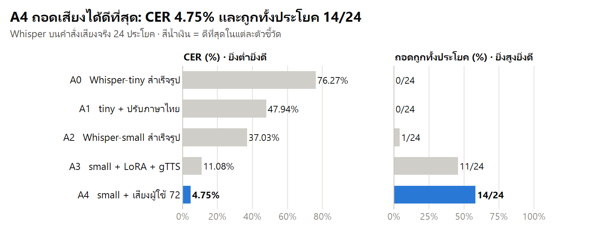
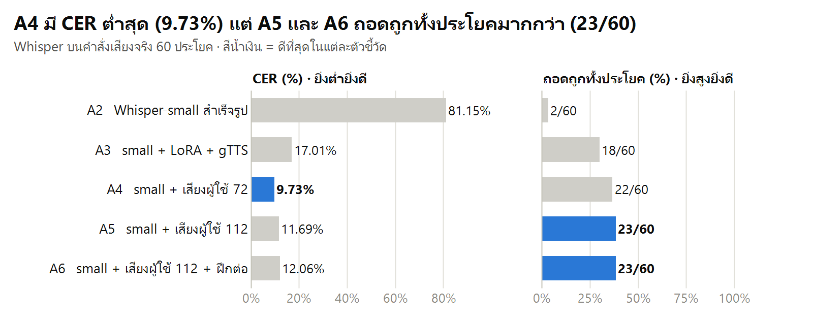
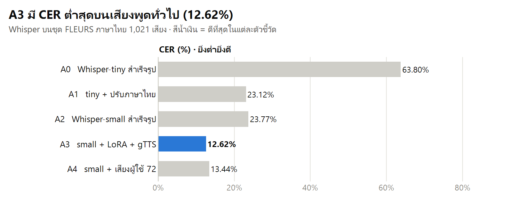
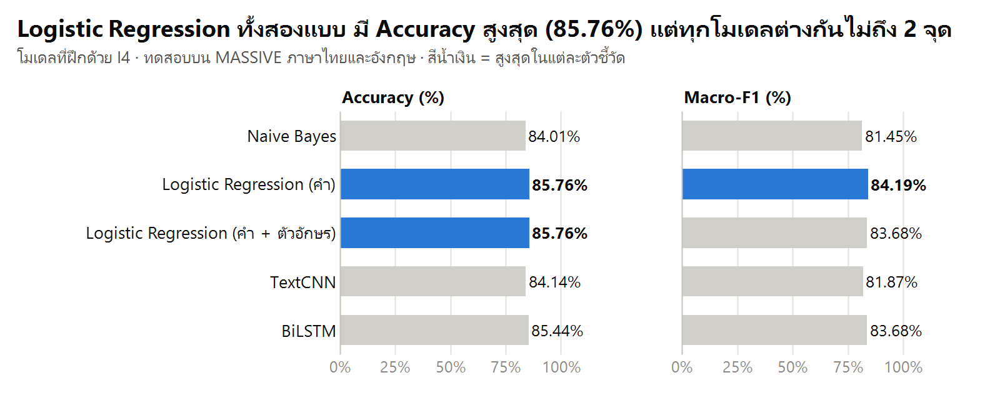
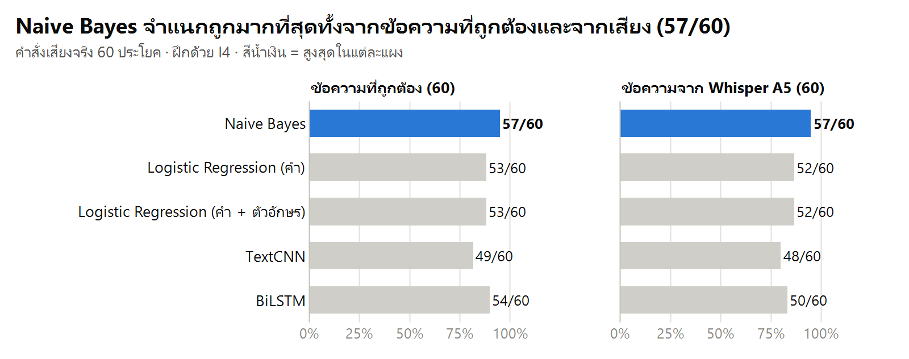
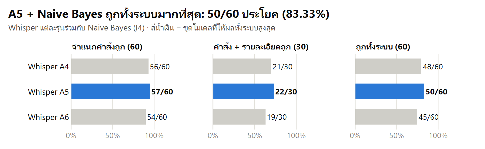

# รายงานการพัฒนาระบบ Speak2Plan

**เรื่อง:** ระบบสั่งงาน Google Tasks และ Google Calendar ด้วยเสียงภาษาไทยปนอังกฤษ
**วันที่จัดทำ:** 6 ตุลาคม 2026

## บทคัดย่อ

รายงานฉบับนี้นำเสนอการพัฒนา Speak2Plan ระบบจัดการงานและนัดหมายด้วยเสียงภาษาไทยปนอังกฤษ ระบบประกอบด้วยการถอดเสียงด้วย Whisper ที่ปรับแต่งเพิ่มเติม การจำแนกเจตนาของผู้ใช้เป็น 6 ประเภท การสกัดชื่องานและวันเวลาจากข้อความ และการเชื่อมต่อ Google Tasks กับ Google Calendar การทดลองเปรียบเทียบโมเดลถอดเสียง 7 แบบและโมเดลจำแนกเจตนา 5 แบบ โดยใช้ทั้งชุดข้อมูลสาธารณะและเสียงคำสั่งจริง ผลการทดสอบเสียงจริง 60 ประโยคพบว่าโมเดลที่เลือกใช้งาน (Whisper-small ที่ปรับแต่งด้วยเสียงผู้ใช้ ร่วมกับ Naive Bayes) จำแนกเจตนาและสกัดข้อมูลที่จำเป็นได้ถูกต้องพร้อมกัน 50 ประโยค หรือ 83% ระบบมีขั้นตอนให้ผู้ใช้ยืนยันก่อนเขียนข้อมูลลงบริการของ Google ข้อจำกัดสำคัญคือชุดทดสอบมีผู้พูดเพียงคนเดียว และมีการใช้ผลจากชุดทดสอบช่วยเลือกโมเดล จึงควรประเมินกับผู้พูดและชุดข้อมูลใหม่ก่อนสรุปความสามารถในการใช้งานทั่วไป

**คำสำคัญ:** การรู้จำเสียงพูด, ภาษาไทยปนอังกฤษ, การจำแนกเจตนา, Google Tasks, Google Calendar

## 1. บทนำ

### 1.1 ที่มาและความสำคัญ

Speak2Plan คือระบบสั่งงาน Google Tasks และ Google Calendar ด้วยเสียงภาษาไทยผสมภาษาอังกฤษ เช่น "เช็ค task ใน google ให้หน่อย" แล้วระบบตอบกลับเป็นเสียง ผู้ใช้จัดการงานและนัดหมายได้โดยไม่ต้องเปิดแอปหรือพิมพ์

### 1.2 ปัญหาและข้อจำกัด

1. **ผู้ช่วยเสียงทั่วไปรองรับภาษาไทยผสมภาษาอังกฤษได้ไม่ดี** คนไทยมักพูดศัพท์อังกฤษปนในประโยค เช่น คำว่า task, meeting, to do, done ซึ่ง ASR ทั่วไปมักถอดคำอังกฤษเป็นภาษาไทยผิด ๆ
2. **Whisper model tiny ถอดเสียงไทยได้ไม่แม่น** บางครั้งสร้างข้อความซ้ำเกินจากเสียงต้นฉบับ
3. **ภาษาไทยไม่มีช่องว่างระหว่างคำ ต้องตัดคำก่อนจำแนก** และข้อความจาก ASR ตัดคำไม่เหมือนข้อความใน dataset ที่เว้นวรรคไว้แล้ว
4. **ข้อมูลคำสั่งภาษาไทยนี้มีน้อยใน Public Dataset** มีคำสั่งเกี่ยวกับรายการงานและปฏิทินไม่มาก
5. **ความผิดพลาดตอนถอดคำสำคัญผิดเพียงคำเดียว** เช่น "นัด" เป็น "นับ", "done" เป็น "ตอน" ทำให้ความหมายผิด
6. **การเขียนข้อมูลลง Google ต้องมั่นใจ** ระบบต้องไม่เพิ่มหรือปิดงานผิดโดยที่ผู้ใช้ไม่ได้ตั้งใจ

### 1.3 วัตถุประสงค์

1. พัฒนาระบบรับคำสั่งเสียงภาษาไทยผสมภาษาอังกฤษเพื่ออ่านและจัดการงานหรือนัดหมายใน Google Tasks และ Google Calendar
2. ปรับแต่งโมเดลถอดเสียงและเปรียบเทียบโมเดลแยกตามวัตถุประสงค์ เพื่อเลือกชุดโมเดลที่เหมาะกับคำสั่ง
3. ประเมินความถูกต้องของการถอดเสียง การแยกตามวัตถุประสงค์ การดึงข้อมูล และผลลัพธ์ทั้งระบบด้วยเสียงคำสั่งจริง
4. เพิ่มขั้นตอนยืนยันข้อมูลก่อนเรียก API ที่เขียนข้อมูล เพื่อลดความผิดพลาดจากการถอดเสียงหรือการตีความคำสั่ง

### 1.4 ขอบเขตของโครงการ

ระบบรองรับการทำงาน 6 แบบ ได้แก่ การดูงาน เพิ่มงาน ปิดงาน ดูนัดหมาย เพิ่มนัดหมาย และคำสั่งอื่น ๆ การทดลองใช้ข้อมูลภาษาไทยและอังกฤษจาก Dataset ของ MASSIVE ข้อมูลเสียงภาษาไทยจาก Dataset ของ FLEURS และชุดเสียงคำสั่งที่ผู้พัฒนาอัดเอง 60 ประโยค การประเมินการเชื่อมต่อกับบริการของ Google ซึ่งเกี่ยวข้องกับการเพิ่มหรือแก้ไขข้อมูล ยังครอบคลุมเฉพาะการตรวจสอบว่าระบบขอการยืนยันจากผู้ใช้ก่อนดำเนินการ และสามารถยกเลิกคำสั่งได้อย่างถูกต้อง

## 2. แนวคิดและแนวทางการแก้ปัญหา

แนวคิดหลักคือแบ่งการทำงานของระบบออกเป็นหลายขั้นตอน โดยมี 2 ส่วนที่ฝึกโมเดลเอง ได้แก่ ระบบแปลงเสียงเป็นข้อความซึ่งนำ Model ของ Whisper มาปรับให้เหมาะกับข้อมูลภาษาไทย และระบบแยกตามวัตถุประสงค์ของผู้ใช้ ซึ่งฝึกโมเดลขึ้นใหม่

1. **เพิ่มความแม่นยำในการแปลงเสียงภาษาไทยเป็นข้อความ:** ปรับ Model ของ Whisper เพิ่มเติมด้วยข้อมูลภาษาไทยจาก Dataset ของ FLEURS และใช้เทคนิค LoRA เพื่อให้สามารถฝึก Whisper-small บน GPU ขนาด 4GB ได้
2. **รองรับคำสั่งและคำภาษาอังกฤษที่ไม่มีใน Dataset ของ FLEURS:** เพิ่มเสียงสังเคราะห์จากข้อความและเสียงของผู้ใช้จริงลงในชุดข้อมูลฝึก เพื่อให้โมเดลคุ้นเคยกับรูปแบบคำสั่งและเสียงของผู้ใช้มากขึ้น
3. **จำแนกสิ่งที่ผู้ใช้ต้องการ:** แบ่งคำสั่งออกเป็น 6 แบบ จากนั้นฝึกและเปรียบเทียบโมเดล Naive Bayes, Logistic Regression, TextCNN และ BiLSTM โดยทดสอบ Logistic Regression ทั้งแบบวิเคราะห์เป็นคำ และแบบวิเคราะห์ทั้งคำและตัวอักษร
4. **เพิ่มข้อมูลคำสั่งเกี่ยวกับงานและปฏิทิน:** ข้อมูลภาษาไทยด้านนี้ยังมีน้อย และข้อมูลหมวด “lists” ใน Dataset ของ MASSIVE ส่วนใหญ่เป็นคำสั่งเกี่ยวกับรายการซื้อของ จึงต้องเพิ่มประโยคที่ผู้พัฒนาและ Claude สร้างขึ้น และเพิ่มจำนวนตัวอย่างในชุดฝึกเป็น 3 เท่า
5. **ลดผลกระทบจากการแปลงเสียงเป็นข้อความผิด:** สร้างตัวอย่างข้อความที่เลียนแบบข้อผิดพลาดซึ่งเกิดจากระบบ ASR จริง โดยนำข้อความไปสร้างเป็นเสียงด้วย gTTS ปรับคุณภาพเสียง แล้วแปลงกลับเป็นข้อความด้วย Whisper จากนั้นนำข้อความที่ได้ไปใช้ฝึกโมเดลแยกตามวัตถุประสงค์
6. **ระบุวันและเวลาจากคำพูดหลายรูปแบบ:** ใช้กฎที่กำหนดไว้เพื่อดึงข้อมูลสำคัญจากคำสั่ง เช่น “พรุ่งนี้” “วันศุกร์หน้า” “บ่ายสอง” “ทุ่มนึง” และ “3pm”
7. **ป้องกันการบันทึกข้อมูลผิดลงในบริการของ Google:** ให้ผู้ใช้ตรวจสอบชื่องานหรือชื่อนัดหมาย รวมถึงวันและเวลา ก่อนบันทึกข้อมูล โดยระบบจะถามยืนยันทุกครั้ง และยกเลิกคำสั่งเมื่อคำตอบของผู้ใช้ไม่ชัดเจน

การแยกระบบแปลงเสียงเป็นข้อความออกจากระบบแยกตามวัตถุประสงค์ ทำให้สามารถเปลี่ยนโมเดลในแต่ละส่วนได้อย่างอิสระ หาก Whisper ที่ปรับเพิ่มเติมแล้วไม่ให้ผลลัพธ์ดีขึ้น ก็สามารถกลับไปใช้ Whisper รุ่นสำเร็จรูปได้ทันที

## 3. วิธีดำเนินงานและการออกแบบระบบ

โครงการพัฒนาด้วยการทดลองหลายรอบ โดยฝึกโมเดล ทดสอบกับเสียงจริง ตรวจสอบข้อผิดพลาด แล้วปรับข้อมูลหรือโมเดลก่อนฝึกใหม่ ในรายงานใช้รหัสสองกลุ่มเพื่อเรียกชื่อการทดลองให้อ่านง่าย ดังนี้

- **A0–A6:** รหัสแทนโมเดลถอดเสียง 7 แบบ ซึ่งมีทั้ง Whisper-tiny และ Whisper-small รุ่นสำเร็จรูปและรุ่นที่ปรับเพิ่มเติม รายละเอียดของแต่ละรหัสอยู่ในหัวข้อ 3.4.2
- **I1–I4:** รหัสแทนชุดข้อมูลฝึก 4 รุ่นสำหรับสอนโมเดลให้แยกสิ่งที่ผู้ใช้ต้องการ ชุดข้อมูลแต่ละรุ่นนำไปฝึกได้หลายโมเดล เช่น Naive Bayes และ TextCNN จึงต้องระบุทั้งชื่อโมเดลและรหัสชุดข้อมูล เช่น “Naive Bayes ที่ฝึกด้วยชุดข้อมูล I4”

### 3.1 ขั้นตอนการดำเนินงาน

1. เตรียมข้อมูลจาก Dataset ของ MASSIVE ภาษาไทยและอังกฤษ แล้วจัดคำสั่งเป็น 6 แบบ พร้อมเตรียมเสียงภาษาไทยจาก Dataset ของ FLEURS สำหรับฝึกระบบแปลงเสียงเป็นข้อความ
2. เชื่อมต่อบัญชี Google ด้วย OAuth และทดสอบการอ่านรายการงานกับนัดหมาย
3. ฝึกโมเดลเริ่มต้น ได้แก่ Naive Bayes และ Logistic Regression แล้ววัดความผิดพลาดของ Whisper รุ่นสำเร็จรูป
4. ปรับ Whisper-tiny เพิ่มเติม และฝึก TextCNN กับ BiLSTM ขึ้นใหม่
5. อัดเสียงคำสั่งจริงเป็นชุดทดสอบ แล้วทดสอบการทำงานตั้งแต่รับเสียงจนทราบว่าผู้ใช้ต้องการทำอะไร
6. ตรวจสอบข้อผิดพลาด ปรับข้อมูลหรือโมเดล แล้วทดลองซ้ำหลายรอบ
7. สร้างกฎสำหรับดึงชื่องาน วัน และเวลาจากคำสั่ง แล้วทดสอบกับประโยคที่มีคำตอบกำกับ 30 ประโยค
8. เชื่อมทุกส่วนของระบบเข้าด้วยกันให้รองรับข้อความ ไฟล์เสียง การสนทนาโต้ตอบ และคำปลุก “เคทู” จากนั้นทดสอบกับบริการของ Google

### 3.2 ลำดับการทำงานของระบบ

คำสั่งสำหรับอ่านข้อมูล (`check_tasks`, `check_calendar`) จะเรียกใช้ Google API ได้ทันที ส่วนคำสั่งที่เพิ่มหรือแก้ไขข้อมูลต้องดึงรายละเอียดสำคัญ เช่น ชื่องาน วัน และเวลา แล้วให้ผู้ใช้ยืนยันก่อน หากคำสั่งอยู่ในกลุ่ม `other` ระบบจะแจ้งว่าไม่สามารถทำตามคำสั่งได้

### 3.3 องค์ประกอบของระบบ

ระบบประกอบด้วยส่วนรับเสียงและตรวจคำปลุก ส่วนแปลงเสียงเป็นข้อความ ส่วนแยกสิ่งที่ผู้ใช้ต้องการและดึงรายละเอียดของคำสั่ง ส่วนเชื่อมต่อ Google Tasks และ Google Calendar และส่วนตอบกลับเป็นเสียง นอกจากนี้ยังมีเครื่องมือสำหรับอัดเสียงและวัดผล โดยฝึกโมเดลเองในส่วนแปลงเสียงเป็นข้อความและส่วนแยกคำสั่ง ส่วนอื่นใช้กฎหรือบริการสำเร็จรูป

- **รับเสียงและตรวจคำปลุก:** ใช้ silero-vad หาเฉพาะช่วงที่มีคนพูด แล้วตรวจหาคำว่า “เคทู” ในข้อความที่ระบบถอดได้ (`src/pipeline.py`)
- **แปลงเสียงเป็นข้อความ (ASR):** ปรับ Whisper-small ด้วยเทคนิค LoRA เพื่อให้เหมาะกับเสียงคำสั่งของโครงการ (`src/asr.py`, `src/train_asr.py`)
- **แยกสิ่งที่ผู้ใช้ต้องการ:** ฝึกและเปรียบเทียบ Naive Bayes, Logistic Regression, TextCNN และ BiLSTM เพื่อแยกคำสั่งเป็น 6 แบบ ได้แก่ `check_tasks`, `add_task`, `complete_task`, `check_calendar`, `add_event` และ `other` หากโมเดลมั่นใจต่ำกว่า 0.4 ระบบจะตอบว่าไม่เข้าใจ (`src/train_intent.py`, `src/models.py`, `src/intent.py`)
- **ดึงรายละเอียดจากคำสั่ง:** ใช้กฎค้นหาชื่องาน วัน และเวลา เช่น “พรุ่งนี้” “วันศุกร์หน้า” “บ่ายสอง” และ “3pm” หากคำสั่งเพิ่มนัดหมายไม่มีเวลา ระบบจะสร้างเป็นนัดหมายตลอดวัน หากไม่มีวัน ระบบจะเลือกวันนี้ หรือเลือกพรุ่งนี้เมื่อเวลาที่ระบุผ่านไปแล้ว นัดหมายทั่วไปกำหนดไว้ 1 ชั่วโมง และคำว่า “1 โมง” ถึง “6 โมง” ที่ไม่มีคำว่า “เช้า” จะตีความเป็นช่วงบ่าย (`src/slots.py`)
- **เชื่อมต่อ Google Tasks และ Google Calendar:** ใช้ OAuth เพื่ออ่าน เพิ่ม และปิดงาน รวมถึงอ่านและเพิ่มนัดหมาย โดยคำสั่งที่เขียนข้อมูลต้องให้ผู้ใช้ยืนยันก่อน (`src/google_api.py`)
- **ตอบกลับเป็นเสียง:** ใช้ gTTS สร้างเสียงตอบกลับให้ผู้ใช้ (`src/pipeline.py`)
- **อัดเสียงและประเมินผล:** ใช้ arecord บันทึกเสียง แล้ววัดอัตราความผิดพลาดระดับตัวอักษร (CER) ระดับคำ (WER) และสัดส่วนคำตอบที่ถูกต้อง (accuracy) (`src/record.py`, `src/eval_e2e.py`, `src/eval_slots.py`)

### 3.4 การออกแบบและพัฒนาโมเดล AI/ML

การออกแบบเน้นให้ระบบเข้าใจคำสั่งภาษาไทยผสมภาษาอังกฤษ แม้มีข้อมูลฝึกและหน่วยความจำ GPU จำกัดเพียง 4GB จึงนำโมเดลถอดเสียงที่มีอยู่แล้วมาปรับเพิ่มเติม และเปรียบเทียบโมเดลแยกคำสั่งหลายแบบ เพื่อหาวิธีที่เหมาะกับข้อมูลของโครงการ

#### 3.4.1 การเลือกโมเดลจำแนกเจตนา

ส่วนนี้ทำหน้าที่แยกข้อความเป็นคำสั่ง 6 แบบ โดยเปรียบเทียบโมเดลพื้นฐานที่ฝึกได้รวดเร็วกับโมเดล Deep Learning ที่เรียนรู้รูปแบบและลำดับของคำได้

ก่อนฝึกโมเดล ระบบจะจัดช่องว่างและตัดคำภาษาไทยด้วย PyThaiNLP ให้ข้อมูลฝึกมีรูปแบบเดียวกับข้อความจาก Whisper เพราะ MASSIVE เว้นวรรคระหว่างคำ แต่ Whisper มักไม่เว้น จากนั้นใช้ TF-IDF เปลี่ยนข้อความเป็นค่าตัวเลขตามความสำคัญของคำ เพื่อให้โมเดลพิจารณาได้ทั้งคำสำคัญและวลีสั้น ๆ

- **Naive Bayes:** เป็นโมเดลพื้นฐานที่ฝึกและให้คำตอบได้เร็ว ใช้ทดสอบว่าคำสำคัญในประโยคเพียงพอสำหรับแยกคำสั่งหรือไม่
- **Logistic Regression (คำ):** เรียนรู้ว่าคำใดมีความสำคัญต่อคำสั่งแต่ละแบบ โดยใช้ข้อมูล TF-IDF ชุดเดียวกับ Naive Bayes เพื่อให้เปรียบเทียบผลกันได้
- **Logistic Regression (คำ + ตัวอักษร):** พิจารณาทั้งคำและกลุ่มตัวอักษรที่อยู่ติดกัน เพราะแม้ Whisper จะถอดคำผิด บางส่วนของคำนั้นอาจยังคล้ายคำเดิม
- **TextCNN:** เรียนรู้รูปแบบของกลุ่มคำสั้น ๆ เช่น วลีที่สื่อถึงการเพิ่มหรือเช็กงาน เพื่อทดสอบว่าการเรียนรู้รูปแบบเหล่านี้จากข้อมูลช่วยได้มากกว่า TF-IDF หรือไม่
- **BiLSTM:** อ่านลำดับคำทั้งสองทิศทาง เพื่อใช้บริบทก่อนและหลังคำในการจำแนก ทดลองว่าลำดับคำและบริบทของทั้งประโยคช่วยแยกคำสั่งที่มีคำคล้ายกันได้หรือไม่

TextCNN และ BiLSTM เรียนรู้ความหมายเชิงตัวเลขของคำจากข้อมูลโครงการ ระหว่างฝึกมีการปิดบางส่วนของโมเดลแบบสุ่ม (dropout) และหยุดฝึกเมื่อผลไม่ดีขึ้น (early stopping) เพื่อลดการจำข้อมูลฝึกมากเกินไป จากนั้นเลือกโมเดลที่ได้ค่า macro-F1 สูงสุด ซึ่งเป็นคะแนนที่ให้ความสำคัญกับคำสั่งทั้ง 6 แบบเท่ากัน

#### 3.4.2 การเลือกและพัฒนาโมเดลถอดเสียง

เลือก Whisper เพราะเป็นโมเดล AI ที่แปลงเสียงหลายภาษาเป็นข้อความได้อยู่แล้ว จึงนำมาปรับให้เหมาะกับภาษาและคำสั่งของโครงการได้โดยไม่ต้องสร้างโมเดลใหม่ทั้งหมด รหัส A0–A6 ใช้แทนโมเดลที่มีขนาด วิธีฝึก หรือข้อมูลฝึกต่างกัน ดังนี้

- **A0 — Whisper-tiny สำเร็จรูป:** ใช้โมเดลขนาดเล็กเป็นผลเริ่มต้นสำหรับเปรียบเทียบกับรุ่นที่ปรับเพิ่มเติม ชื่อโมเดลคือ `openai/whisper-tiny`
- **A1 — Whisper-tiny ปรับด้วยภาษาไทย:** นำ Whisper-tiny มาฝึกเพิ่มเติมด้วย Dataset ของ FLEURS ภาษาไทย เพื่อให้ถอดเสียงไทยได้ดีขึ้น บันทึกที่ `models/whisper-th`
- **A2 — Whisper-small สำเร็จรูป:** เนื่องจาก A1 ยังถอดคำสั่งจริงผิด จึงทดลองรุ่นที่ใหญ่ขึ้นเพื่อดูว่าความสามารถของโมเดลตั้งต้นช่วยแก้ปัญหาได้เพียงใด ชื่อโมเดลคือ `openai/whisper-small`
- **A3 — Whisper-small + LoRA + เสียงสังเคราะห์:** การปรับโมเดล Whisper-small ทั้งหมดใช้หน่วยความจำเกิน 4GB จึงใช้ LoRA เพื่อฝึกเฉพาะส่วนเสริมขนาดเล็ก และเพิ่มเสียงคำสั่งที่สร้างจากข้อความ เพราะ FLEURS ไม่มีคำสั่งจัดการงานและคำภาษาอังกฤษที่ระบบต้องใช้ นอกจากนี้ยังปรับความเร็วและเพิ่มเสียงรบกวนให้ข้อมูลมีความหลากหลายขึ้น บันทึกที่ `models/whisper-small-th`
- **A4 — Whisper-small + เสียงผู้ใช้ 72 ประโยค:** ใช้วิธีเดียวกับ A3 แล้วเพิ่มเสียงจริงของผู้ใช้ เพื่อให้โมเดลคุ้นเคยกับลักษณะเสียง การออกเสียง และการพูดภาษาไทยผสมภาษาอังกฤษ บันทึกที่ `models/whisper-small-th-v2`
- **A5 — Whisper-small + เสียงผู้ใช้ 112 ประโยค:** ใช้วิธีฝึกเดียวกับ A4 และเพิ่มเสียงผู้ใช้ที่เน้นตัวเลขเวลา เพราะเวลาในคำสั่งนัดหมายถอดผิดบ่อยและส่งผลต่อการสร้างนัดหมายโดยตรง บันทึกที่ `models/whisper-small-th-v3`
- **A6 — Whisper-small + เสียงผู้ใช้ 112 ประโยค + เพิ่มขั้นฝึก:** ใช้ข้อมูลและวิธีฝึกเดียวกับ A5 แต่เพิ่มจำนวนขั้นฝึกจาก 800 เป็น 1,200 เพราะข้อผิดพลาดบนชุดพัฒนายังลดลงเมื่อจบการฝึกรอบเดิม จึงทดลองว่าการฝึกต่อช่วยกับคำสั่งจริงด้วยหรือไม่ บันทึกที่ `models/whisper-small-th-v4`

เลขในรหัส A0–A6 นับรวมการทดลองทั้ง Whisper-tiny และ Whisper-small ส่วน `v2`, `v3` และ `v4` ในชื่อโฟลเดอร์ใช้ระบุรุ่นของ Whisper-small ที่ปรับแต่งในโครงการ จึงตรงกับรหัส A4, A5 และ A6 ตามลำดับ

ระหว่างฝึกจะเก็บโมเดลที่มีอัตราความผิดพลาดระดับตัวอักษร (CER) ต่ำที่สุดบนชุดตรวจสอบของ FLEURS แล้วนำไปทดสอบกับเสียงคำสั่งจริงอีกครั้ง เพราะผลจากเสียงทั่วไปอาจไม่ตรงกับผลเมื่อใช้งานจริง

#### 3.4.3 การพัฒนาข้อมูลสำหรับโมเดลจำแนกเจตนา

ชุดข้อมูลฝึก I1–I4 เริ่มจาก Dataset ของ MASSIVE ซึ่งมีตัวอย่างภาษาไทยและอังกฤษ แต่บางหมวดไม่ตรงกับงานของระบบ เช่น หมวด “lists” ที่ส่วนใหญ่เป็นรายการซื้อของ จึงเพิ่มคำสั่งเกี่ยวกับงาน นัดหมาย และตัวอย่างข้อความที่ Whisper ถอดผิด เพื่อให้ข้อมูลฝึกใกล้กับสิ่งที่พบเมื่อใช้งานจริง

- **I1 — ชุดข้อมูลเริ่มต้น:** ใช้ MASSIVE ภาษาไทยและอังกฤษร่วมกับประโยคที่ผู้พัฒนาเขียน และลดจำนวนตัวอย่าง `other` เพราะมีมากกว่าคำสั่งประเภทอื่น เพื่อให้ข้อมูลแต่ละประเภทสมดุลขึ้น
- **I2 — เพิ่มคำสั่งเฉพาะงานและตัวอย่างที่ถอดเสียงผิด:** เพิ่มประโยคที่ Claude ช่วยสร้างเพื่อให้มีรูปแบบคำสั่งหลากหลายขึ้น พร้อมเพิ่มข้อความที่ Whisper ถอดผิด และเพิ่มจำนวนตัวอย่างเฉพาะงาน เพื่อไม่ให้มีสัดส่วนน้อยเกินไปเมื่อรวมกับ MASSIVE
- **I3 — ชุดข้อมูลเพิ่มประโยคผู้ใช้ 72 ประโยค:** ใช้ข้อความจากชุดเสียงฝึกของผู้ใช้ เพื่อให้โมเดลเรียนรู้สำนวนที่อาจไม่มีในข้อมูลทั่วไป และประเมินร่วมกับโมเดลถอดเสียง A4
- **I4 — ชุดข้อมูลเพิ่มประโยคผู้ใช้เป็น 112 ประโยค:** เพิ่มข้อความจากชุดเสียงฝึกที่ขยายใน A5 เพื่อให้โมเดลพบคำสั่งนัดหมายที่ระบุเวลาได้หลากหลายขึ้น

ตัวอย่างข้อความที่ถอดผิดสร้างโดยนำประโยคคำสั่งไปสร้างเป็นเสียงด้วย gTTS จากนั้นปรับความเร็ว เพิ่มเสียงรบกวน และใช้ Whisper แปลงกลับเป็นข้อความ โดยยังระบุประเภทคำสั่งเหมือนประโยคเดิม วิธีนี้ทำให้โมเดลได้เรียนรู้ทั้งข้อความที่เขียนถูกและข้อความที่อาจถอดผิดจริง ผลการเปรียบเทียบแสดงในบทที่ 4

### 3.5 เครื่องมือ เทคโนโลยี และชุดข้อมูล

#### 3.5.1 เครื่องมือที่ใช้

- **Python 3.12:** ภาษาหลักสำหรับพัฒนาระบบ
- **PyTorch และ CUDA:** ใช้ฝึกและเรียกใช้งานโมเดล Deep Learning บน GPU
- **Hugging Face:** ใช้เครื่องมือ transformers, peft, accelerate และ evaluate สำหรับดาวน์โหลด ปรับ และวัดผลโมเดล Whisper
- **scikit-learn:** สร้าง TF-IDF และฝึกโมเดล Naive Bayes กับ Logistic Regression
- **PyThaiNLP:** ตัดคำภาษาไทยก่อนจำแนกเจตนา
- **librosa และ soundfile:** อ่านและประมวลผลไฟล์เสียง
- **silero-vad:** ตรวจจับและตัดช่วงที่มีเสียงพูด
- **jiwer:** คำนวณอัตราความผิดพลาดระดับตัวอักษร (CER) และระดับคำ (WER)
- **dateparser:** แปลงข้อความวันและเวลาเป็นข้อมูลวันที่
- **google-api-python-client และ google-auth-oauthlib:** เชื่อมต่อ Google Tasks/Calendar และยืนยันสิทธิ์ด้วย OAuth
- **gTTS:** สร้างเสียงตอบกลับและเสียงสังเคราะห์สำหรับข้อมูลฝึก
- **NVIDIA RTX 2050 4GB:** GPU ที่ใช้ฝึกโมเดล

#### 3.5.2 ชุดข้อมูลที่ใช้

- **Dataset ของ MASSIVE**
  - ประกอบด้วยข้อความคำสั่งภาษาไทยและภาษาอังกฤษ
  - มีข้อมูลฝึกประมาณ 11,500 ประโยคต่อภาษา
  - ใช้ฝึกและทดสอบโมเดลจำแนกประเภทคำสั่ง

- **Dataset ของ FLEURS**
  - ประกอบด้วยเสียงพูดภาษาไทยพร้อมข้อความถอดเสียง
  - มีข้อมูลฝึก 2,602 เสียง รวมประมาณ 8.5 ชั่วโมง
  - ใช้ปรับและทดสอบโมเดล Whisper

- **ชุดข้อความคำสั่งที่ผู้พัฒนาเขียน** (`data/custom_intents.csv`)
  - มีข้อความคำสั่งเฉพาะงานจำนวน 30 ประโยค
  - ใช้ฝึกโมเดลจำแนกประเภทคำสั่ง

- **ชุดข้อความคำสั่งที่ Claude สร้าง** (`data/generated_intents.csv`)
  - มีข้อความคำสั่งหลายรูปแบบจำนวน 150 ประโยค
  - ใช้เพิ่มความหลากหลายให้ข้อมูลฝึก

- **ชุดข้อความที่จำลองข้อผิดพลาดของ Whisper** (`data/augmented_intents.csv`)
  - มีข้อความจำนวน 720 ประโยค
  - สร้างโดยนำข้อความไปสร้างเป็นเสียงด้วย gTTS แล้วใช้ Whisper แปลงกลับเป็นข้อความ
  - ใช้ช่วยให้โมเดลจำแนกคำสั่งรับมือกับข้อความที่ Whisper ถอดผิด

- **ชุดไฟล์เสียงคำสั่งที่ผู้พัฒนาอัดสำหรับฝึกโมเดล** (`data/audio_train/`)
  - มีเสียงคำสั่งจำนวน 112 เสียง พร้อมข้อความของแต่ละเสียง
  - ใช้ปรับโมเดล Whisper และฝึกโมเดลจำแนกประเภทคำสั่ง

- **ชุดไฟล์เสียงคำสั่งสำหรับทดสอบระบบ** (`data/audio/`)
  - มีเสียงคำสั่งจำนวน 60 เสียง แบ่งเป็นคำสั่งประเภทละ 10 เสียง
  - อัดแยกจากชุดเสียงฝึก และใช้ทดสอบการทำงานของระบบทั้งหมด

- **ชุดคำตอบสำหรับทดสอบการดึงข้อมูล** (`data/slots_gold.csv`)
  - มีคำตอบที่ถูกต้องของชื่องาน วัน และเวลา จำนวน 30 ประโยค
  - ใช้ตรวจสอบว่าระบบดึงรายละเอียดจากคำสั่งได้ถูกต้องหรือไม่

ชุดเสียงทดสอบถูกแยกออกจากชุดข้อมูลฝึก โดยประโยคที่คล้ายกับข้อมูลฝึกมากที่สุดมีค่าความคล้าย 0.73 จึงไม่มีประโยคที่เหมือนกับข้อมูลฝึกทั้งหมด

## 4. ผลการทดลองและการวิเคราะห์ผล

### 4.1 ผลลัพธ์ที่ได้จากการพัฒนา

- ระบบรับคำสั่งได้ทั้งการพิมพ์ข้อความ ไฟล์เสียง การพูดโต้ตอบ และการเรียกด้วยคำปลุก “เคทู”
- ระบบแยกคำสั่งได้ 6 แบบ คือ ดูงาน เพิ่มงาน ปิดงาน ดูนัดหมาย เพิ่มนัดหมาย และคำสั่งอื่น ๆ
- ระบบมีขั้นตอนให้ผู้ใช้ตรวจสอบและยืนยันข้อมูลก่อนเพิ่มงาน ปิดงาน หรือเพิ่มนัดหมาย และสามารถยกเลิกคำสั่งได้
- ชุดโมเดลที่เลือกใช้คือ **Whisper-small รุ่น A5 ร่วมกับ Naive Bayes ที่ฝึกด้วยชุดข้อมูล I4** บนเสียงคำสั่งจริง 60 ประโยค จำแนกประเภทคำสั่งถูก 57 ประโยค (95.00%) และถูกทั้งประเภทคำสั่งกับรายละเอียดที่จำเป็น 50 ประโยค (83.33%)

ข้อมูลของแต่ละโมเดล พร้อมไฟล์ต้นทางและตาราง CSV อยู่ใน [ข้อมูลสรุปผล](summary/README.md)

### 4.2 การทดสอบและตัวชี้วัดที่ใช้ประเมินผล

การทดสอบใช้เสียงภาษาไทยจาก dataset (FLEURS) จำนวน 1,021 เสียง ข้อความภาษาไทยและอังกฤษจาก dataset (MASSIVE) และเสียงคำสั่งที่ผู้พัฒนาอัดจำนวน 24 และ 60 ประโยค โดยใช้เกณฑ์ดังนี้

- **ความผิดพลาดในการถอดเสียง (CER):** วัดจำนวนตัวอักษรที่ถอดผิด ขาด หรือเกิน เทียบกับข้อความที่ถูกต้อง ค่ายิ่งต่ำยิ่งดี
- **ถอดถูกทั้งประโยค:** นับประโยคที่ Whisper แปลงเป็นข้อความได้ตรงกับคำตอบ หลังจัดรูปแบบข้อความแล้ว
- **ความถูกต้องในการจำแนกคำสั่ง (Accuracy):** วัดว่าระบบแยกสิ่งที่ผู้ใช้ต้องการได้ถูกต้องกี่ประโยค เช่น แยกได้ว่าเป็นคำสั่งเพิ่มงานหรือเพิ่มนัดหมาย
- **คะแนนจำแนกเฉลี่ยของแต่ละประเภท (Macro-F1):** เฉลี่ยคะแนน F1 ของคำสั่งทั้ง 6 แบบ โดยให้ความสำคัญกับแต่ละแบบเท่ากัน ค่ายิ่งสูงยิ่งดี
- **ความถูกต้องทั้งระบบ:** คำสั่งดูข้อมูลและคำสั่งอื่นต้องจำแนกประเภทถูก ส่วนคำสั่งเพิ่มงาน ปิดงาน และเพิ่มนัดหมายต้องถูกทั้งประเภทคำสั่ง ชื่อ วัน และเวลาที่เกี่ยวข้อง ชื่อถือว่าถูกเมื่อมีค่าความคล้ายกับคำตอบตั้งแต่ 0.8 ขึ้นไป

#### 4.2.1 ผลการแปลงเสียงเป็นข้อความ

บนเสียงคำสั่ง 24 ประโยค A4 มีความผิดพลาดต่ำที่สุด **4.75%** และถอดถูกทั้งประโยค 14/24 ประโยค (58.33%) เทียบกับ Whisper-small รุ่นสำเร็จรูป A2 ซึ่งมีความผิดพลาด 37.03%

เมื่อทดสอบ 60 ประโยค A4 ยังมีความผิดพลาดต่ำที่สุด **9.73%** ส่วน A5 และ A6 มีความผิดพลาด 11.69% และ 12.06% แต่ถอดถูกทั้งประโยค 23/60 ประโยค (38.33%) เท่ากัน ขณะที่ A4 ถอดถูก 22/60 ประโยค (36.67%)

อัตราการถอดเสียงถูกทั้งประโยคสูงสุดเพียง **38.33%** จึงถือว่ายังค่อนข้างต่ำ อย่างไรก็ตาม ค่านี้เป็นเกณฑ์ที่เข้มงวด เพราะหากถอดผิด ขาด หรือเกินแม้เพียงคำหรือตัวอักษรเดียว ประโยคนั้นจะถูกนับว่าผิดทั้งหมด จึงไม่ควรตีความว่าเป็นความแม่นยำในการแปลภาษาหรือความแม่นยำของระบบโดยรวม แม้ข้อความจะไม่ตรงกับคำตอบทุกตัวอักษร คำสำคัญอาจยังเพียงพอให้ระบบจำแนกประเภทคำสั่งได้ถูกต้อง ดังเห็นได้จาก A5 ซึ่งถอดถูกทั้งประโยค 38.33% แต่จำแนกประเภทคำสั่งจากเสียงได้ 95.00%

บน FLEURS A3 มีความผิดพลาดต่ำที่สุด **12.62%** ส่วน A4 ได้ 13.44% โมเดลที่ดีที่สุดบนเสียงทั่วไปจึงต่างจากโมเดลที่ดีที่สุดบนเสียงคำสั่งจริง โดย A5 และ A6 ไม่มีผลทดสอบ FLEURS ที่บันทึกไว้

ชุด 60 ประโยคประกอบด้วย 24 ประโยคเดิมและ 36 ประโยคที่เพิ่มภายหลัง การเปรียบเทียบแต่ละครั้งจึงใช้ผลจากชุดทดสอบเดียวกัน รายละเอียดทุกโมเดลอยู่ในไฟล์สรุปแยก

#### 4.2.2 ผลการจำแนกประเภทคำสั่ง

เปรียบเทียบโมเดลที่ฝึกด้วยชุดข้อมูล I4 บนข้อความจาก MASSIVE และเสียงคำสั่งจริง 60 ประโยค

บน MASSIVE **Logistic Regression ทั้งสองแบบจำแนกถูกสูงสุด 85.76%** แบบใช้คำมี Macro-F1 เท่ากับ 84.19% สูงกว่าแบบใช้คำร่วมกับตัวอักษรที่ได้ 83.68%

| โมเดล | จำแนกถูกบน MASSIVE | จำแนกจากข้อความที่ถูกต้อง / 60 | จำแนกจากเสียงผ่าน Whisper A5 / 60 |
| --- | ---: | ---: | ---: |
| Naive Bayes | 84.01% | 57/60 (95.00%) | **57/60 (95.00%)** |
| Logistic Regression (คำ) | **85.76%** | 53/60 (88.33%) | 52/60 (86.67%) |
| Logistic Regression (คำ + ตัวอักษร) | **85.76%** | 53/60 (88.33%) | 52/60 (86.67%) |
| TextCNN | 84.14% | 49/60 (81.67%) | 48/60 (80.00%) |
| BiLSTM | 85.44% | 54/60 (90.00%) | 50/60 (83.33%) |

บนเสียงคำสั่งจริง **Naive Bayes จำแนกถูกสูงสุด 95.00%** จึงเลือกใช้โมเดลนี้ แม้ Logistic Regression จะให้ผลสูงกว่าบน MASSIVE จำนวนคำสั่งที่ Naive Bayes จำแนกถูกจากข้อความและเสียงเท่ากัน แต่ไม่ได้หมายความว่า Whisper ถอดเสียงถูกทุกประโยค

#### 4.2.3 ผลการดึงรายละเอียดและผลทั้งระบบ

ใช้ Naive Bayes ร่วมกับ Whisper รุ่น A4, A5 และ A6 ทดสอบคำสั่งเพิ่มงาน ปิดงาน และเพิ่มนัดหมายอย่างละ 10 ประโยค รวม 30 ประโยค และคำสั่งดูข้อมูลหรือคำสั่งอื่นอีก 30 ประโยค

| Whisper + Naive Bayes | เพิ่มงาน | ปิดงาน | เพิ่มนัดหมาย | ประเภทคำสั่งและรายละเอียดถูก / 30 | ถูกทั้งระบบ / 60 |
| --- | ---: | ---: | ---: | ---: | ---: |
| A4 | 9/10 | 7/10 | 5/10 | 21/30 (70.00%) | 48/60 (80.00%) |
| A5 | 8/10 | 8/10 | 6/10 | **22/30 (73.33%)** | **50/60 (83.33%)** |
| A6 | 6/10 | 7/10 | 6/10 | 19/30 (63.33%) | 45/60 (75.00%) |

A5 ให้ผลทั้งระบบสูงสุด **50/60 ประโยค (83.33%)** มากกว่า A4 จำนวน 2 ประโยค จึงเลือก A5 ร่วมกับ Naive Bayes แม้ A4 จะมีอัตราความผิดพลาดในการถอดเสียงต่ำกว่า

เมื่อใช้ข้อความที่ถูกต้อง ระบบจำแนกคำสั่งและดึงรายละเอียดถูกครบ 30/30 ประโยค แต่เมื่อใช้เสียงผ่าน A5 เหลือ 22/30 ประโยค โดยคำสั่งเพิ่มนัดหมายถูกเพียง 6/10 ประโยค จึงยังต้องปรับปรุงการถอดชื่อ วัน และเวลา

### 4.3 วิเคราะห์ว่าผลลัพธ์เป็นไปตามเป้าหมายหรือไม่

- **พัฒนาระบบจัดการงานและนัดหมายด้วยเสียง — ทำได้บางส่วน:** ระบบอ่านข้อมูลจากบัญชี Google จริงได้ และมีขั้นยืนยันก่อนเพิ่มหรือแก้ไขข้อมูล แต่ยังไม่ได้ทดสอบการเพิ่มนัดหมายลง Google Calendar จริง
- **ปรับโมเดลถอดเสียงและเปรียบเทียบโมเดลจำแนกคำสั่ง — ทำได้ตามเป้าหมาย:** ทดลอง Whisper 7 แบบ และโมเดลจำแนกคำสั่ง 5 แบบ โดยโมเดลที่เหมาะกับคำสั่งจริงคือ A5 ร่วมกับ Naive Bayes
- **ประเมินผลด้วยเสียงคำสั่งจริง — ทำได้ตามเป้าหมาย:** วัดผลการถอดเสียง การจำแนกคำสั่ง การดึงรายละเอียด และผลทั้งระบบ โดยชุดโมเดลที่เลือกจำแนกถูก 95.00% และถูกทั้งคำสั่งกับรายละเอียด 83.33%
- **เพิ่มขั้นตอนยืนยันก่อนบันทึกข้อมูล — ทำได้ตามขอบเขตที่ทดสอบ:** ระบบขอให้ผู้ใช้ยืนยันและยกเลิกคำสั่งได้ แต่ยังต้องทดสอบร่วมกับการบันทึกข้อมูลจริงให้ครบทุกคำสั่ง

### 4.4 ปัญหา ข้อจำกัด และสิ่งที่สามารถพัฒนาต่อได้

**ปัญหาและข้อจำกัด**

- Whisper ยังถอดชื่อและเวลาในบางคำสั่งผิด ทำให้รายละเอียดที่จะบันทึกผิด แม้จำแนกประเภทคำสั่งถูกแล้ว
- อัตราการถอดเสียงตรงกับข้อความอ้างอิงทั้งประโยคของโมเดลที่ดีที่สุดอยู่ที่ 38.33% แม้การจำแนกประเภทคำสั่งยังทำได้ 95.00% แสดงว่าระบบทนต่อความคลาดเคลื่อนบางส่วนได้ แต่การถอดข้อความตามคำพูดทุกคำยังต้องปรับปรุง
- ชุดเสียงทดสอบมีผู้พูดเพียงคนเดียว ซึ่งเป็นคนเดียวกับผู้ที่อัดเสียงฝึก จึงยังสรุปไม่ได้ว่าจะให้ผลเท่ากันกับผู้ใช้คนอื่น
- มีการใช้ชุดทดสอบช่วยเลือกโมเดลและปรับกฎดึงข้อมูล คะแนนที่ได้จึงต้องตรวจซ้ำด้วยข้อมูลใหม่ที่ไม่เคยใช้ปรับระบบ
- ชุดทดสอบมีเพียง 60 ประโยค และผลของ A5 สูงกว่า A4 เพียง 2 ประโยค จึงยังสรุปไม่ได้ว่า A5 จะดีกว่าเสมอ
- การทดสอบปิดงานใช้รายการงานจำลอง และยังไม่ได้ทดสอบเพิ่มนัดหมายลง Google Calendar จริง ดังนั้น 83.33% เป็นความถูกต้องของคำสั่งและรายละเอียด ไม่ใช่อัตราการบันทึกข้อมูลลง Google สำเร็จ
- ระบบยังไม่รองรับนัดหมายซ้ำ เช่น “ทุกวันอังคาร” และคำบอกเวลาภาษาอังกฤษบางรูปแบบยังตีความผิด
- ยังไม่ได้ทดสอบคำปลุก “เคทู” ร่วมกับโมเดล A5

**สิ่งที่สามารถพัฒนาต่อได้**

- เพิ่มชุดทดสอบจากผู้พูดหลายคน และเพิ่มคำสั่งที่มีชื่อ วันที่ เวลา และคำภาษาอังกฤษหลายรูปแบบ
- แยกชุดข้อมูลสำหรับปรับและเลือกโมเดลออกจากชุดทดสอบสุดท้าย เพื่อให้คะแนนสะท้อนผลกับข้อมูลใหม่
- ปรับการถอดเสียงและกฎดึงชื่อ วัน และเวลา โดยเน้นคำสั่งเพิ่มนัดหมายที่ยังผิดมากที่สุด
- ทดลองช่วยให้ Whisper รู้จักคำเฉพาะ เช่น task, done และชื่องาน รวมถึงเปรียบเทียบโมเดลจำแนกคำสั่งอื่นเพิ่มเติม
- เพิ่มการแก้ไข ลบ และสร้างนัดหมายซ้ำ พร้อมทดสอบการบันทึกข้อมูลจริงลง Google และการยกเลิกคำสั่งให้ครบ

## เอกสารอ้างอิงและแหล่งข้อมูล

- [MASSIVE](https://github.com/alexa/massive) (Amazon), CC-BY-4.0
- [FLEURS](https://huggingface.co/datasets/google/fleurs) (Google), CC-BY-4.0
- `data/generated_intents.csv` เขียนโดย Claude (Anthropic)
- ตัวเลขทั้งหมดจาก `reports/asr/`, `reports/intent/`, `reports/e2e/`
