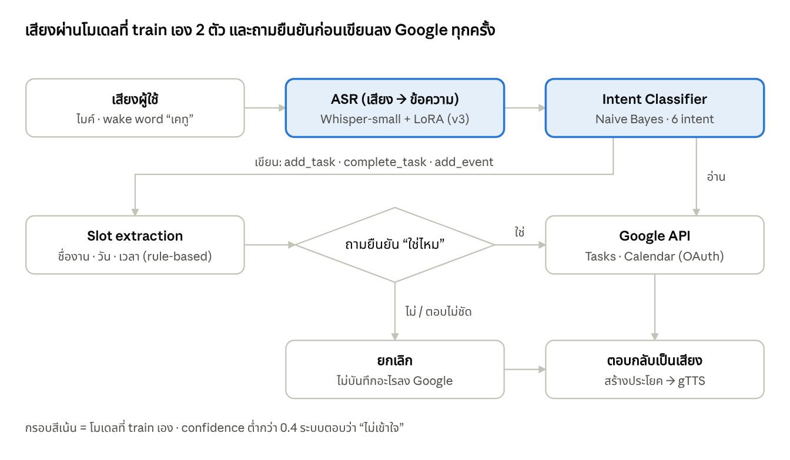
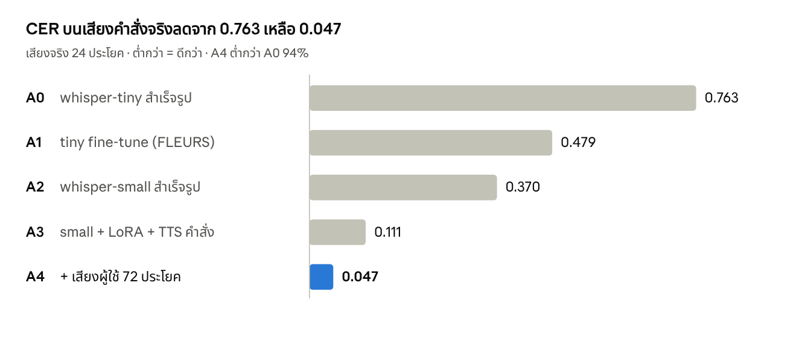

# รายงานการพัฒนาระบบ Speak2Plan

**เรื่อง:** ระบบสั่งงาน Google Tasks และ Google Calendar ด้วยเสียงภาษาไทยปนอังกฤษ  
**วันที่จัดทำ:** 6 ตุลาคม 2026

## บทคัดย่อ

รายงานฉบับนี้นำเสนอการพัฒนา Speak2Plan ระบบจัดการงานและนัดหมายด้วยเสียงภาษาไทยปนอังกฤษ ระบบประกอบด้วยการถอดเสียงด้วย Whisper ที่ปรับแต่งเพิ่มเติม การจำแนกเจตนาของผู้ใช้เป็น 6 ประเภท การสกัดชื่องานและวันเวลาจากข้อความ และการเชื่อมต่อ Google Tasks กับ Google Calendar การทดลองเปรียบเทียบโมเดลถอดเสียง 7 รุ่นและโมเดลจำแนกเจตนา 5 แบบ โดยใช้ทั้งชุดข้อมูลสาธารณะและเสียงคำสั่งจริง ผลการทดสอบเสียงจริง 60 ประโยคพบว่าโมเดลที่เลือกใช้งาน (Whisper-small รุ่น A5 ร่วมกับ Naive Bayes) จำแนกเจตนาและสกัดข้อมูลที่จำเป็นได้ถูกต้องพร้อมกัน 50 ประโยค หรือ 83% ระบบมีขั้นตอนให้ผู้ใช้ยืนยันก่อนเขียนข้อมูลลงบริการของ Google ข้อจำกัดสำคัญคือชุดทดสอบมีผู้พูดเพียงคนเดียว และมีการใช้ผลจากชุดทดสอบช่วยเลือกโมเดล จึงควรประเมินกับผู้พูดและชุดข้อมูลใหม่ก่อนสรุปความสามารถในการใช้งานทั่วไป

**คำสำคัญ:** การรู้จำเสียงพูด, ภาษาไทยปนอังกฤษ, การจำแนกเจตนา, Google Tasks, Google Calendar

## 1. บทนำ

### 1.1 ที่มาและความสำคัญ

Speak2Plan คือระบบสั่งงาน Google Tasks และ Google Calendar ด้วยเสียงภาษาไทยปนอังกฤษ เช่น "เช็ค task ใน google ให้หน่อย" แล้วระบบตอบกลับเป็นเสียง ผู้ใช้จัดการงานและนัดหมายได้โดยไม่ต้องเปิดแอปหรือพิมพ์

### 1.2 ปัญหาและข้อจำกัด

- **ผู้ช่วยเสียงทั่วไปรองรับภาษาไทยปนอังกฤษได้ไม่ดี** คนไทยมักพูดศัพท์อังกฤษปนในประโยค (task, meeting, to do, done) ซึ่ง ASR ทั่วไปมักถอดคำอังกฤษเป็นภาษาไทยผิด ๆ
- **Whisper สำเร็จรูปรุ่นเล็กถอดเสียงไทยได้ไม่แม่น** whisper-tiny มี CER 0.638 บน FLEURS และ 0.763 บนเสียงคำสั่งจริง บางครั้งสร้างข้อความซ้ำเกินจากเสียงต้นฉบับ
- **ภาษาไทยไม่มีช่องว่างระหว่างคำ** ต้องตัดคำก่อนจำแนก และข้อความจาก ASR ตัดคำไม่เหมือนข้อความใน dataset ที่เว้นวรรคไว้แล้ว
- **ข้อมูลคำสั่งภาษาไทยในโดเมนนี้มีน้อย** ชุดข้อมูลสาธารณะ MASSIVE มีคำสั่งเกี่ยวกับรายการงานและปฏิทินไม่มาก โดยหมวด "lists" ส่วนใหญ่เป็นรายการซื้อของ
- **ความผิดพลาดสะสมข้ามขั้นตอน** ASR ถอดคำสำคัญผิดเพียงคำเดียว ("นัด" เป็น "นับ", "done" เป็น "ตอน") ทำให้ intent พลิกหรือบันทึกวันเวลาผิดใน Google ได้
- **การเขียนข้อมูลลง Google ต้องปลอดภัย** ระบบต้องไม่เพิ่มหรือปิดงานผิดโดยที่ผู้ใช้ไม่ได้ตั้งใจ

### 1.3 วัตถุประสงค์

1. พัฒนาระบบรับคำสั่งเสียงภาษาไทยปนอังกฤษเพื่ออ่านและจัดการงานหรือนัดหมายใน Google Tasks และ Google Calendar
2. ปรับแต่งโมเดลถอดเสียงและเปรียบเทียบโมเดลจำแนกเจตนา เพื่อเลือกชุดโมเดลที่เหมาะกับคำสั่งในโดเมนนี้
3. ประเมินความถูกต้องของการถอดเสียง การจำแนกเจตนา การสกัดข้อมูล และผลลัพธ์ทั้งระบบด้วยเสียงคำสั่งจริง
4. เพิ่มขั้นตอนยืนยันข้อมูลก่อนเรียก API ที่เขียนข้อมูล เพื่อลดความผิดพลาดจากการถอดเสียงหรือการตีความคำสั่ง

### 1.4 ขอบเขตของโครงการ

ระบบรองรับ 6 เจตนา ได้แก่ การดูงาน เพิ่มงาน ปิดงาน ดูนัดหมาย เพิ่มนัดหมาย และคำสั่งอื่น ๆ การทดลองใช้ข้อมูลภาษาไทยและอังกฤษจาก MASSIVE ข้อมูลเสียงภาษาไทยจาก FLEURS และชุดเสียงคำสั่งที่ผู้พัฒนาอัดเอง 60 ประโยค การประเมินการเชื่อมต่อ Google ที่เขียนข้อมูลยังจำกัดอยู่ที่การตรวจขั้นยืนยันและการยกเลิกคำสั่ง โดยยังไม่ได้ทดสอบการเพิ่มนัดหมายลง Google Calendar จริง

## 2. แนวคิดและแนวทางการแก้ปัญหา

แนวคิดหลักคือแยกงานเป็น pipeline ที่ train เอง 2 ส่วน คือ ASR (fine-tune Whisper) และ Intent Classifier (train from scratch) ส่วนที่เหลือใช้ rule-based และ API สำเร็จรูป เพื่อให้แต่ละส่วนวัดผลและปรับปรุงแยกกันได้

| ปัญหา | Solution | ผลที่ได้ |
| --- | --- | --- |
| Whisper สำเร็จรูปถอดไทยไม่แม่น | Fine-tune Whisper ด้วย FLEURS ไทย (transfer learning) และใช้ LoRA กับ whisper-small ให้เทรนบน GPU 4GB ได้ | CER เสียงจริง 0.370 → 0.111 (24 ประโยค) |
| คำสั่งและคำอังกฤษไม่อยู่ใน FLEURS | เพิ่มเสียง TTS ของประโยคคำสั่ง และเสียงผู้ใช้เอง (speaker adaptation) เข้าชุดเทรน | CER 0.111 → 0.047 (24 ประโยคเดิม) |
| จำแนกความต้องการของผู้ใช้ | นิยาม 6 intent และเทรน NB / LogReg / TextCNN / BiLSTM เทียบกัน | NB ผ่านเสียงจริง 0.933 (60 ประโยค) |
| ข้อมูลในโดเมนน้อย / MASSIVE "lists" คือ shopping list | เขียนประโยคเอง + ประโยคที่ Claude เขียน + oversample ×3 | intent บนข้อความถูก 0.50–0.63 → 0.88–0.92 |
| ASR error ทำให้ intent พลิก | สร้างข้อความที่มี ASR error จริง (gTTS → perturb → Whisper) 720 แถว มาเทรน intent | ช่องว่าง reference กับผ่านเสียงเหลือ 0.95 vs 0.933 (NB) |
| วัน/เวลาภาษาไทยพูดได้หลายแบบ | Rule-based slot extraction (พรุ่งนี้, วันศุกร์หน้า, บ่ายสอง, ทุ่มนึง, 3pm) | slot บนข้อความถูก 30/30 |
| เขียนข้อมูลผิดลง Google | ถามยืนยัน "ใช่ไหม" ก่อนทุก intent ที่เขียน ตอบไม่ชัด = ยกเลิก | ผู้ใช้ตรวจชื่อ/วัน/เวลาก่อนบันทึก |

การแยก ASR กับ intent ทำให้สลับโมเดลได้อิสระ ถ้า fine-tune ไม่ดีขึ้นก็กลับไปใช้ Whisper สำเร็จรูปได้ทันที

## 3. วิธีดำเนินงานและการออกแบบระบบ

โครงการพัฒนาแบบวนซ้ำ ได้แก่ ฝึกโมเดล ทดสอบกับเสียงจริง วิเคราะห์ข้อผิดพลาด และปรับข้อมูลหรือโมเดลก่อนฝึกใหม่ การทดลองเปรียบเทียบ ASR รวม 7 รุ่น (A0–A6) และชุดข้อมูลฝึกโมเดลจำแนกเจตนา 4 รุ่น (I1–I4)

### 3.1 ขั้นตอนการดำเนินงาน

1. เตรียมข้อมูล: โหลด MASSIVE (th-TH, en-US) แมปเป็น 6 intent และโหลด FLEURS `th_th` สำหรับ ASR
2. ทำ Google OAuth และทดสอบ list tasks / list events ตั้งแต่ต้น
3. เทรน baseline intent (Naive Bayes, Logistic Regression บน TF-IDF) และวัด CER ของ Whisper สำเร็จรูป
4. Fine-tune Whisper-tiny และเทรน TextCNN / BiLSTM from scratch
5. อัดเสียงคำสั่งจริงเป็น test set และทดสอบ end-to-end (เสียง → ASR → intent)
6. วิเคราะห์ error แล้วปรับข้อมูล/โมเดล (ดู iv) วนซ้ำหลายรอบ
7. เขียน rule-based slot extraction และวัดผลด้วยเฉลย 30 ประโยค
8. ต่อ pipeline ครบ (พิมพ์ / ไฟล์เสียง / interactive / wake word "เคทู") และทดสอบกับ Google จริง

### 3.2 ลำดับการทำงานของระบบ

Intent แบบอ่าน (`check_tasks`, `check_calendar`) เรียก Google API ทันที ส่วน intent แบบเขียนต้องดึง slot และผ่านการยืนยันก่อน intent `other` ตอบกลับว่าทำไม่ได้

### 3.3 องค์ประกอบของระบบ

| องค์ประกอบ | ไฟล์ | วิธี | เทรนเอง? |
| --- | --- | --- | --- |
| ASR (เสียง → ข้อความ) | `src/asr.py`, `src/train_asr.py` | Whisper-small + LoRA | Fine-tune |
| Intent Classifier | `src/train_intent.py`, `src/models.py`, `src/intent.py` | NB / LogReg / TextCNN / BiLSTM | Train from scratch |
| Slot extraction | `src/slots.py` | Rule-based: วัน (พรุ่งนี้, วันศุกร์หน้า, วันที่สิบห้า), เวลา (บ่ายสอง, ทุ่มนึง, 3pm), ชื่องาน | ไม่ |
| Google Tasks / Calendar | `src/google_api.py` | OAuth + list/add/complete task, list/add event | ไม่ |
| ตอบกลับเป็นเสียง | `src/pipeline.py` | gTTS | ไม่ |
| Wake word "เคทู" | `src/pipeline.py` | silero-vad ตัดช่วงพูด + ตรวจคำในข้อความ ASR | ไม่ |
| เครื่องมืออัดเสียง / ประเมิน | `src/record.py`, `src/eval_e2e.py`, `src/eval_slots.py` | arecord, CER/WER, accuracy | ไม่ |

**6 intent:** `check_tasks`, `add_task`, `complete_task`, `check_calendar`, `add_event`, `other` — intent ที่เขียนข้อมูล (add/complete) ถามยืนยันก่อนเสมอ และถ้า confidence ต่ำกว่า 0.4 ระบบตอบว่าไม่เข้าใจ

**กฎ add_event:** ไม่มีเวลา = นัดทั้งวัน, ไม่มีวัน = วันนี้ (พรุ่งนี้ถ้าเวลาผ่านไปแล้ว), ยาว 1 ชม., "N โมง" 1–6 ที่ไม่มี "เช้า" = บ่าย

### 3.4 การออกแบบและพัฒนาโมเดล AI/ML

#### 3.4.1 สถาปัตยกรรมโมเดลจำแนกเจตนา

| โมเดล | Feature | รายละเอียด |
| --- | --- | --- |
| Naive Bayes | TF-IDF unigram + bigram (ตัดคำ PyThaiNLP) | MultinomialNB, alpha 0.1 |
| Logistic Regression | TF-IDF unigram + bigram | C = 10 |
| LogReg (char) | TF-IDF คำ + char n-gram 2–4 | C = 10 — เพิ่มใน v2 เพื่อทนคำสะกดผิดจาก ASR |
| TextCNN (Kim 2014) | Embedding 128 มิติ (สุ่มเริ่มต้น) | Conv1D kernel 2/3/4 × 100 filters → max-over-time pooling → dropout 0.5 → linear |
| BiLSTM | Embedding 128 มิติ | BiLSTM hidden 128 → ต่อ hidden สองทิศ → dropout 0.5 → linear |

CNN/LSTM เทรนด้วย Adam lr 1e-3, batch 64, สูงสุด 30 epoch, early stopping patience 5, cross-entropy loss ก่อนตัดคำ `normalize()` ลบช่องว่างระหว่างอักษรไทย เพราะ MASSIVE เว้นวรรคทุกคำแต่ Whisper ไม่เว้น

#### 3.4.2 การพัฒนาโมเดลถอดเสียงแต่ละรุ่น

การพัฒนาเริ่มจาก Whisper-tiny สำเร็จรูป (A0) แล้วปรับแต่งด้วยเสียงภาษาไทยจาก FLEURS เป็น A1 เมื่อทดสอบกับคำสั่งจริงพบว่าผลยังไม่ดีพอ จึงเปลี่ยนไปใช้ Whisper-small สำเร็จรูป (A2) เป็นฐานของการทดลองต่อไป รุ่น A3 เพิ่มเสียงสังเคราะห์ของประโยคคำสั่งและใช้ LoRA เพื่อลดการใช้หน่วยความจำ GPU ส่วน A4 และ A5 เพิ่มเสียงพูดของผู้ใช้จริงตามลำดับ รุ่น A6 ทดลองเพิ่มจำนวนขั้นฝึกเพื่อดูว่าค่า CER บนชุดพัฒนาจะลดลงต่อหรือไม่ ตารางต่อไปสรุปข้อมูลฝึกและเหตุผลของการเปลี่ยนแต่ละรุ่น

| Version | โมเดล | สิ่งที่เปลี่ยน | เหตุผล | dev CER |
| --- | --- | --- | --- | --- |
| A0 | `openai/whisper-tiny` | สำเร็จรูป (baseline) | จุดเริ่มต้น | — |
| A1 | `whisper-th` | Full fine-tune tiny ด้วย FLEURS 2,602 ประโยค, 1,500 steps (~9 epoch), lr 3.75e-5, batch 8 × accum 2 | ทดสอบ transfer learning บน GPU 4GB | 0.211 |
| A2 | `openai/whisper-small` | สำเร็จรูป รุ่นใหญ่กว่า | A1 ยังแย่บนเสียงจริง (CER 0.479) | — |
| A3 | `whisper-small-th` | LoRA r=32 (q/k/v/out), base fp16, gradient checkpointing, 800 steps; train = FLEURS + เสียง TTS ประโยคคำสั่ง ×4 (ปรับ speed/noise) | full fine-tune small ไม่พอดี GPU, FLEURS ไม่มีคำสั่ง | 0.123 |
| A4 | `whisper-small-th-v2` | + เสียงผู้ใช้ 72 ประโยค (12/intent, 3.3 นาที) ×6 | speaker adaptation + คำอังกฤษในคำสั่ง | 0.119 |
| A5 | `whisper-small-th-v3` | prompt ผู้ใช้เพิ่มเป็น 112 (เพิ่ม 40 ประโยคที่เน้นตัวเลขเวลา) | เวลาใน add_event ถอดผิดบ่อย | 0.123 |
| A6 | `whisper-small-th-v4` | เหมือน A5 แต่ 1,200 steps (4.8 epoch, 106 นาที) | dev CER ยังลดอยู่ตอน 800 steps | **0.116** |

dev CER วัดบน FLEURS dev 200 ประโยคระหว่างเทรน เก็บ checkpoint ที่ dev CER ต่ำสุด LoRA ใช้ lr 1e-3, batch 4 × accum 4, peak GPU 1.6GB, 800 steps ใช้เวลา ~75 นาทีบน RTX 2050

#### 3.4.3 การพัฒนาโมเดลจำแนกเจตนาแต่ละรุ่น

การทดลองโมเดลจำแนกเจตนาใช้ชุดข้อมูล 4 รุ่น โดยเริ่มจาก MASSIVE และประโยคที่เขียนเองใน I1 ผลบนคำสั่งจริงต่ำกว่าผลบนชุดข้อมูลทั่วไป จึงเพิ่มประโยคเฉพาะโดเมนและข้อความที่จำลองความผิดพลาดจาก ASR ใน I2 จากนั้น I3 และ I4 เพิ่มข้อความจากเสียงผู้ใช้จริง เพื่อให้โมเดลพบสำนวนและรูปแบบเวลาที่ใกล้การใช้งานมากขึ้น แต่ละรุ่นใช้เปรียบเทียบโมเดลพื้นฐานกับ TextCNN และ BiLSTM ภายใต้ข้อมูลฝึกที่เปลี่ยนไปดังตาราง

| Version | ข้อมูลเทรน | สิ่งที่เปลี่ยน | เหตุผล |
| --- | --- | --- | --- |
| I1 | MASSIVE th+en + เขียนเอง 5 ประโยค/intent | NB, LogReg, TextCNN, BiLSTM; `other` สุ่มเก็บ 12% กัน imbalance | baseline |
| I2 | + ประโยคที่ Claude เขียน 25/intent + ข้อความ ASR-augmented 720 แถว, oversample in-domain ×3 | เพิ่ม LogReg (char) | I1 บนคำสั่งจริงได้แค่ 0.50–0.63; MASSIVE "lists" = shopping list |
| I3 | + ข้อความชุดเสียงผู้ใช้ 72 ประโยค | เทรนคู่กับ ASR A4 | ให้เห็นสำนวนที่ผู้ใช้พูดจริง |
| I4 | + prompt ผู้ใช้ 112 ประโยค | เทรนคู่กับ ASR A5 (ตัวที่ใช้จริง) | เพิ่มประโยค add_event ที่มีเวลา |

ข้อความ ASR-augmented สร้างด้วย `src/augment_asr.py`: ประโยคในโดเมน → gTTS → ปรับ speed/noise → Whisper (whisper-th + small) ได้ข้อความที่มี ASR error จริง ให้ classifier ทนต่อการถอดเสียงผิด

### 3.5 เครื่องมือ เทคโนโลยี และชุดข้อมูล

**เครื่องมือ:** Python 3.12, PyTorch (CUDA), Hugging Face transformers / peft / accelerate / evaluate, scikit-learn, PyThaiNLP, jiwer, librosa / soundfile, dateparser, google-api-python-client + google-auth-oauthlib, gTTS, silero-vad — เทรนบน GPU NVIDIA RTX 2050 4GB

| Dataset | ที่มา | ขนาด | ใช้ทำอะไร |
| --- | --- | --- | --- |
| [MASSIVE](https://github.com/alexa/massive) th-TH + en-US | Amazon, CC-BY-4.0 | ~11.5k train / 2k dev / 3k test ต่อภาษา | เทรน/ทดสอบ intent (แมป 60 → 6 intent) |
| [FLEURS](https://huggingface.co/datasets/google/fleurs) th_th | Google, CC-BY-4.0 | 2,602 train (8.5 ชม.) / 439 dev / 1,021 test | Fine-tune และทดสอบ ASR |
| `data/custom_intents.csv` | เขียนเอง | 30 ประโยค | เทรน intent |
| `data/generated_intents.csv` | เขียนโดย Claude | 150 ประโยค (25/intent) | เทรน intent |
| `data/augmented_intents.csv` | gTTS → Whisper | 720 แถว | เทรน intent ให้ทน ASR error |
| `data/audio_train/` | อัดเสียงผู้ใช้ | 112 ประโยค | เทรน ASR (speaker adaptation) + intent |
| `data/audio/` (test) | อัดเสียงผู้ใช้ | 60 ประโยค (10/intent) | ทดสอบ end-to-end เท่านั้น |
| `data/slots_gold.csv` | เขียนเฉลยเอง | 30 ประโยค | ทดสอบ slot |

ชุดทดสอบแยกจากชุดเทรน: ประโยคใน test มี similarity กับ train สูงสุด 0.73

## 4. ผลการทดลองและการวิเคราะห์ผล

ระบบทำงานได้ครบตั้งแต่เสียงจนถึง Google: บนเสียงคำสั่งจริง 60 ประโยค ทำถูกทั้ง intent และ slot **50/60 (83%)** ด้วย ASR A5 + Naive Bayes จากเดิมที่ intent ผ่านเสียงถูกแค่ 21–38% ในรอบแรก

### 4.1 ผลลัพธ์ของระบบ

- สั่งงานได้ 4 แบบ: พิมพ์ข้อความ (`--text`), ไฟล์เสียง (`--audio`), interactive และปลุกด้วย wake word "เคทู" (`--wake`)
- ทำครบ 6 intent พร้อมขั้นยืนยันก่อนเขียน check_calendar จำกัดช่วงตามคำถาม (พรุ่งนี้ / วันศุกร์ / สัปดาห์นี้ / อาทิตย์หน้า)
- โมเดลที่ใช้จริง: ASR `models/whisper-small-th-v3` (A5) + intent Naive Bayes (I4)

### 4.2 วิธีประเมินและตัวชี้วัด

| ส่วน | ตัวชี้วัด | ชุดทดสอบ |
| --- | --- | --- |
| ASR | CER (หลัก เพราะไทยไม่มีช่องว่าง), WER หลังตัดคำ, exact match | FLEURS test 1,021 / เสียงจริง 24 และ 60 ประโยค |
| Intent | Accuracy, macro-F1, confusion matrix | MASSIVE test th+en / เสียงจริง (ข้อความถูก vs ผ่าน ASR) |
| Slot | ถูกทั้งชื่องาน + วัน + เวลา | 30 ประโยค write (เฉลย `data/slots_gold.csv`) |
| ทั้งระบบ | intent + slot ถูกทั้งหมด | เสียงจริง 60 ประโยค |

### 4.3 ผลการถอดเสียงตามรุ่น

ผลบนชุดเสียงคำสั่ง 24 ประโยคแสดงให้เห็นว่าการเปลี่ยนจาก A2 ไปเป็น A3 ซึ่งเพิ่มเสียงสังเคราะห์เฉพาะโดเมน ลด CER จาก 0.370 เหลือ 0.111 และการเพิ่มเสียงผู้ใช้จริงใน A4 ลดต่อเหลือ 0.047 อย่างไรก็ตาม เมื่อขยายชุดทดสอบเป็น 60 ประโยค A4 ให้ CER ต่ำสุดที่ 0.097 ขณะที่ A5 ให้ผลทั้งระบบดีกว่าเล็กน้อย ตารางต่อไปแยกผลจาก FLEURS และเสียงจริงทั้งสองชุด เพื่อไม่ให้เปรียบเทียบค่าที่วัดคนละชุดโดยตรง

*ที่มา: `reports/e2e/summary_v1.json`, `summary_v2.json`, `summary_v3_24.json` · เสียงจริง 24 ประโยค*

| รุ่น | FLEURS test CER | เสียงจริง 24: CER | เสียงจริง 60: CER / WER / ถูกทั้งประโยค | สรุปผลรายรุ่น |
| --- | --- | --- | --- | --- |
| A0 Whisper-tiny | 0.638 | 0.763 | — | จุดเริ่มต้น; ถอดเสียงไทยและคำสั่งจริงผิดมาก |
| A1 Tiny ปรับแต่ง | 0.231 | 0.479 | — | ดีขึ้นมากบน FLEURS แต่ยังผิดบนคำสั่งจริง |
| A2 Whisper-small | 0.238 | 0.370 | 0.812 / 1.267 / 3% | รุ่นสำเร็จรูปขนาดใหญ่ขึ้นช่วยบนชุด 24 ประโยค |
| A3 Small + LoRA + TTS | **0.126** | 0.111 | 0.170 / 0.380 / 30% | ข้อมูลคำสั่งเฉพาะโดเมนลดข้อผิดพลาดอย่างชัดเจน |
| A4 + เสียงผู้ใช้ 72 ประโยค | 0.134 | **0.047** | **0.097 / 0.238 / 37%** | CER บนเสียงจริงต่ำสุด แต่ FLEURS แย่ลงเล็กน้อย |
| A5 + เสียงผู้ใช้ 112 ประโยค | — | — | 0.117 / 0.238 / **38%** | ถูกทั้งประโยคมากขึ้นและให้ผลทั้งระบบดีที่สุด |
| A6 + ฝึก 1,200 steps | — | — | 0.121 / 0.238 / 38% | dev CER ต่ำสุด แต่เสียงจริงและผลทั้งระบบลดลง |

ชุด 60 ประโยคประกอบด้วย 24 ประโยคเดิมและ 36 ประโยคที่เขียนเพิ่มหลังฝึกโมเดลบางรุ่น A0/A1 ไม่ได้ประเมินบนชุด 60 ประโยค ส่วน A5/A6 ไม่ได้ประเมินบนชุด 24 ประโยคหรือ FLEURS test ดังนั้นช่องที่ไม่มีผลจึงแสดงเป็นขีดไว้ ผล A1 และ A2 บน FLEURS ใกล้เคียงกัน แต่ A2 ดีกว่าบนคำสั่งจริง แสดงว่าชุดทดสอบทั่วไปไม่เพียงพอสำหรับเลือกโมเดลในงานนี้ สำหรับ A6 แม้ dev CER ต่ำสุดที่ 0.116 แต่ชื่องานในเสียงจริงผิดเพิ่มขึ้น จึงไม่ได้เลือกใช้

### 4.4 ผลการจำแนกเจตนาตามรุ่น

ผลการประเมินมีสองส่วน ได้แก่ ชุดทดสอบ MASSIVE ที่ใช้วัดความสามารถกับประโยคทั่วไป และชุดเสียงคำสั่งจริงที่ใช้วัดงานของระบบโดยตรง บน MASSIVE โมเดล TF-IDF แบบพื้นฐานยังให้ผลดี โดย Logistic Regression มี accuracy สูงสุดทั้ง I1 และ I4 การเพิ่มข้อมูลเฉพาะโดเมนไม่ได้ทำให้ผลบน MASSIVE ลดลงอย่างชัดเจน ตารางแรกเปรียบเทียบโมเดลก่อนและหลังเพิ่มข้อมูล ส่วนตารางถัดไปสรุปผลของข้อมูลฝึกแต่ละเวอร์ชันบนคำสั่งจริง

| โมเดล | I1 acc / F1 | I4 acc / F1 | I4 acc ไทย / อังกฤษ |
| --- | --- | --- | --- |
| Naive Bayes | 0.837 / 0.815 | 0.840 / 0.814 | 0.803 / 0.876 |
| LogReg | **0.860 / 0.844** | **0.858 / 0.842** | 0.817 / 0.897 |
| LogReg (char) | — | 0.858 / 0.837 | 0.823 / 0.892 |
| TextCNN | 0.811 / 0.808 | 0.841 / 0.819 | 0.798 / 0.884 |
| BiLSTM | 0.828 / 0.815 | 0.854 / 0.837 | **0.828** / 0.880 |

สำหรับเสียงคำสั่งจริง I1 จำแนกจากข้อความอ้างอิงได้เพียง 0.50–0.63 และลดลงอีกเมื่อผ่าน ASR การเพิ่มประโยคเฉพาะโดเมนใน I2 ทำให้ผลจากข้อความอ้างอิงเพิ่มเป็น 0.88–0.92 เมื่อเพิ่มข้อความจากเสียงผู้ใช้ใน I3 และ I4 ผลผ่าน ASR โดยรวมสูงกว่ารุ่นแรก อย่างไรก็ตาม ตัวเลขระหว่างรุ่นใช้ ASR และขนาดชุดทดสอบต่างกัน จึงอ่านเป็นแนวโน้มการพัฒนามากกว่าผลของการเปลี่ยนข้อมูลฝึกเพียงอย่างเดียว ช่วง accuracy ในตารางหมายถึงค่าต่ำสุดถึงสูงสุดของโมเดลที่ทดลองในรุ่นนั้น

| รุ่นข้อมูลฝึก | เสียงทดสอบ | Accuracy จากข้อความอ้างอิง | Accuracy ผ่าน ASR | ASR ที่ใช้ | สรุปผลรายรุ่น |
| --- | --- | --- | --- | --- | --- |
| I1 | 24 ประโยค | 0.50–0.63 | 0.21–0.38 | A1 | ข้อมูลทั่วไปยังไม่ครอบคลุมคำสั่งในงานนี้ |
| I2 | 24 ประโยค | 0.88–0.92 | 0.71–0.79 | A3 | ข้อมูลเฉพาะโดเมนช่วยเพิ่มความแม่นยำมากที่สุด |
| I3 | 24 ประโยค | 0.92–0.96 | 0.88–0.96 | A4 | เสียงผู้ใช้จริงช่วยให้ผลบนประโยคเดิมดีขึ้น |
| I3 | 60 ประโยค | 0.82–0.95 | 0.80–0.93 | A4 | ชุดใหม่เผยความต่างระหว่างโมเดลชัดขึ้น |
| I4 | 60 ประโยค | 0.82–0.95 | 0.80–0.95; NB 0.95 | A5 | Naive Bayes ให้ผลผ่านเสียงสูงสุดในชุดที่ใช้เลือกโมเดล |

เมื่อดูเฉพาะ 24 ประโยคเดิม CNN และ BiLSTM ผ่าน A4 ได้ 0.958 แต่บน 36 ประโยคใหม่เหลือ 0.694 และ 0.833 ตามลำดับ ขณะที่ Naive Bayes ได้ 0.944 จึงมีข้อบ่งชี้ว่าโมเดล deep learning อาจจดจำสำนวนเดิมมากเกินไป ระบบจึงเลือก Naive Bayes ใน I4 ซึ่งทำได้ 0.95 ทั้งจากข้อความอ้างอิงและเสียงจริง 60 ประโยค บน MASSIVE หมวด `check_calendar` ยังมี F1 ต่ำสุดราว 0.70–0.76 และ `add_task` กับ `add_event` สับสนกันได้ (ดู [confusion matrix ของ Naive Bayes](intent/nb_confusion.png))

### 4.5 ผลการสกัดข้อมูลและผลทั้งระบบ

การวัดผลทั้งระบบต้องถูกทั้งเจตนาและข้อมูลที่ใช้ทำคำสั่ง ได้แก่ ชื่องาน วัน และเวลาที่เกี่ยวข้อง ข้อความอ้างอิงให้ผลการสกัดข้อมูลถูกครบ 30 ประโยค แต่เมื่อผ่าน ASR ความผิดพลาดในข้อความต้นทางทำให้ผลลดลง รุ่น A5 ถูก 22 จาก 30 คำสั่งที่เขียนข้อมูล และถูกทั้งระบบ 50 จาก 60 ประโยค ซึ่งสูงกว่า A4 และ A6 ตามตาราง

| ASR | add_task | complete_task | add_event | Slot รวม | ทั้งระบบ 60 ประโยค |
| --- | --- | --- | --- | --- | --- |
| ข้อความถูก | 10/10 | 10/10 | 10/10 | 30/30 | — |
| A4 (v2) | 9/10 | 7/10 | 5/10 | 21/30 | 48/60 (80%) |
| A5 (v3) — ใช้จริง | 8/10 | 8/10 | 6/10 | **22/30** | **50/60 (83%)** |
| A6 (v4) | 6/10 | 7/10 | 6/10 | 19/30 | 45/60 (75%) |

Intent แบบ read-only ผ่าน A4: check_calendar 10/10, other 9/10, check_tasks 8/10 — error ที่เหลือเกิดที่ ASR เพี้ยนชื่อ/เวลา: "เก้าโมง" → "ก้าโมง", "at nine" → "at night", "team sync" → "team sing", thursday → tuesday

### 4.6 ผลเทียบกับวัตถุประสงค์

| เป้าหมาย | ผล | สถานะ |
| --- | --- | --- |
| Fine-tune Whisper ให้ดีกว่าสำเร็จรูป | CER เสียงจริง 0.370 → 0.047 (24 ประโยค) | บรรลุ |
| Train intent from scratch เทียบ baseline | เทรนและเทียบครบ 5 โมเดล; baseline ชนะ | บรรลุ (ผลต่างจากที่คาด) |
| Pipeline ใช้งานได้จริงกับ Google | read-only ทดสอบกับบัญชีจริงแล้ว; add_event ทดสอบเฉพาะการยกเลิก | บรรลุบางส่วน |
| ทนต่อภาษาไทยปนอังกฤษ | ทั้งระบบ 83%; คำอังกฤษบางคำยังพลาด | บรรลุบางส่วน |

## 5. อภิปรายผล ข้อจำกัด และแนวทางพัฒนา

ผลการทดลองแสดงว่าการเพิ่มข้อมูลคำสั่งเฉพาะโดเมนช่วยยกระดับทั้งการถอดเสียงและการจำแนกเจตนา โดยเฉพาะเมื่อเทียบกับโมเดลเริ่มต้นที่ฝึกจากข้อมูลทั่วไป อย่างไรก็ตาม ค่า CER บน FLEURS และเสียงคำสั่งจริงเปลี่ยนไปคนละทิศทางในบางรุ่น จึงต้องพิจารณาผลจากชุดข้อมูลที่ใกล้การใช้งานจริงร่วมด้วย ความถูกต้องทั้งระบบ 83% ยังต่ำกว่าความถูกต้องของการจำแนกเจตนาเพียงอย่างเดียว เพราะข้อผิดพลาดด้านชื่องาน วัน และเวลาสะสมระหว่างขั้นตอน

### 5.1 ข้อจำกัดด้านการประเมิน

- ทดสอบเสียงผู้พูดคนเดียว (คนเดียวกับ train) ยังไม่รู้ว่า generalize กับคนอื่นแค่ไหน
- เลือกโมเดล (A5, NB) และจูน slot rule (87% → 100%) จากชุดทดสอบ 60 ประโยค = test-set selection ตัวเลขจริงอาจต่ำกว่านี้
- ชุดทดสอบ 60 ประโยคมีขนาดเล็ก โดย A4 และ A5 ต่างกันเพียง 2 ประโยค จึงยังสรุปความเหนือกว่าของรุ่นใดรุ่นหนึ่งได้จำกัด
- dev CER บน FLEURS ไม่สะท้อนเสียงคำสั่งจริง (A6) ควรมี dev set ที่เป็นเสียงคำสั่งแยกต่างหาก
- ประโยค "เช็ค task ใน google ให้หน่อย" ในชุดเทรนคล้าย test cmd01 88%

### 5.2 ข้อจำกัดของระบบ

- คำสำคัญเพี้ยนคำเดียวทำให้ intent พลิก ("done" → "ตอน") และเวลา/ชื่อผิดใน add_event
- ยังไม่รองรับนัดซ้ำ ("ทุกวันอังคาร") และ "at seven" / "night at eight" อาจได้เวลาเช้า (ขั้นยืนยันช่วยจับ)
- A5 ถอดประโยคภาษาอังกฤษล้วนแย่กว่า A4 และ wake word "เคทู" กับ A5 ยังไม่ได้ทดสอบ
- ยังไม่ได้ทดสอบการเขียนลง Google Calendar จริง

### 5.3 แนวทางพัฒนาต่อ

- ให้ผู้พูดคนอื่นอัดเสียงชุดทดสอบ (`python -m src.record --set friend`) เพื่อวัดความสามารถในการใช้กับผู้พูดใหม่
- แยกชุดพัฒนาเสียงคำสั่งสำหรับเลือกโมเดล แล้วประเมินชุดทดสอบเพียงครั้งเดียว
- ทดลองใช้ prompt หรือ hotword สำหรับศัพท์เฉพาะระหว่างถอดเสียง เช่น task, done และชื่องานใน Google Tasks
- เปรียบเทียบกับโมเดลภาษาไทยที่ปรับแต่งเพิ่มเติม เช่น WangchanBERTa
- รองรับนัดหมายซ้ำ การแก้ไขและลบนัดหมาย พร้อมทดสอบการเขียนลง Google Calendar จริง

## 6. สรุปผล

Speak2Plan สามารถรับเสียงภาษาไทยปนอังกฤษ ถอดข้อความ จำแนกเจตนา สกัดข้อมูลคำสั่ง และเชื่อมต่อบริการ Google ได้ตามขอบเขตที่ทดสอบ โมเดล A5 ร่วมกับ Naive Bayes ทำงานถูกต้องทั้งเจตนาและข้อมูลที่จำเป็น 50 จาก 60 ประโยคเสียงจริง การทดลองชี้ว่าข้อมูลคำสั่งเฉพาะโดเมนและเสียงของผู้ใช้ช่วยเพิ่มความแม่นยำได้มาก แต่ผลยังต้องยืนยันด้วยเสียงจากผู้พูดใหม่และชุดทดสอบที่ไม่ได้ใช้เลือกโมเดล

## เอกสารอ้างอิงและแหล่งข้อมูล

- [MASSIVE](https://github.com/alexa/massive) (Amazon), CC-BY-4.0
- [FLEURS](https://huggingface.co/datasets/google/fleurs) (Google), CC-BY-4.0
- `data/generated_intents.csv` เขียนโดย Claude (Anthropic)
- ตัวเลขทั้งหมดจาก `reports/asr/`, `reports/intent/`, `reports/e2e/`
